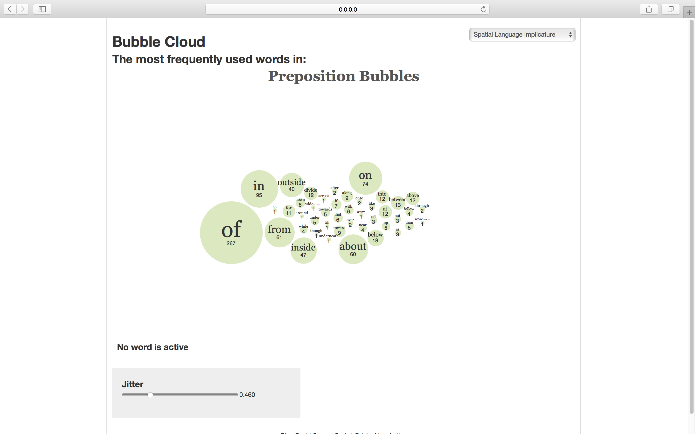

# NLP-POS-Object-Tagging-Psych204
## Data Processing Pipline for Psych 204 Project
### POS(Part of Speech) Tagging
```python
python posTagger.py
python posTaggerTest.py
```
### Object Parser
'''python
python objectParser.py
'''
### Run POS Tagging and Preposition Bubble
'''
sh runBubble.sh
'''
[](bubble.png)
